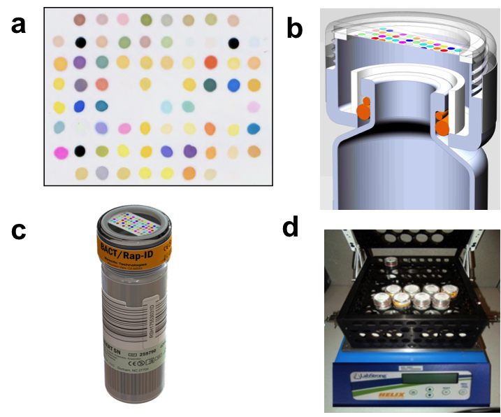

# Smelling Sepsis
=================
A cascading, series model to quickly and accurately predict the first three steps in sepsis diagnosis utilizing electronic nose sensor data from [Specific technologies](http://specifictechnologies.net/).

## i. Contents

+ [What is sepsis?](#sepsis)
+ [How do we smell sepsis?](#csa)
+ [Designing a Cascading, Series Model](#cascadeseries)
+ [Longitudinal Analysis](#features)
+ [Designing a Triggered, Series Model](#trigger)
+ [Results](#results)
+ [Installation and Dependencies](#install)
+ [Data format and data structures](#data)
+ [Code walkthrough and examples](#code)
+ [Contact](#contact)


## <a name="sepsis"></a> What is sepsis?

Sepsis is the bodies overwhelming immune response to infection and is often caused by a blood stream infection by fungi, or, most commonly, bacteria. Sepsis constitutes a serious medical emergency requiring immeadiate medical attention.  258,000 americans die from sepsis every year and it remains the leading cause of death of conditions contracted once in the hospital (e.g. an infection developed after surgery) and the third leading cause of death in the U.S.  Global statistics are harder to estimate; in the developing world it is estimated that 60-80% of deaths are from sepsis *(for more information on sepsis and treatment, read about it [here](http://www.sepsis.org/) or [here](http://www.world-sepsis-day.org/?MET=SHOWCONTAINER&vCONTAINERID=11).*

Treatment of sepsis is all about speed: fast action is the key to survival.  But current treatment requires a four-step diagnositc process that can take up to a week.  The longer treatment is delayed, the more bacteria proliferate, lowering the likelihood of survival.  Below, I outline the four steps.

*NOTE: I am not a microbiologist nor a physician, but I will do my best below to walk you through some of the medical and scientific jargon below.*
	
#### 1. Detection - Am I sick?

+ 8 hours to 4 days (to confirm negative)

First, a doctor needs to confirm that you have an infection.  They perform a **blood culture** by taking a small sample of your blood (typically 10 mL) and injecting it into a bottle  of growth media designed to provide the optimal environment for bacteria, if present, to flourish and grow (i.e they **innoculate** a *"blood culture"* or *"growth media"* bottle).  The innoculated blood culture bottles is then placed inside a **blood culture instrument** which tracks the presence of carbon dioxide expired by bacteria as they grow.  If bacteria are present, they will rapidly multiply, produce a large amount of carbon dioxide, and the blood culture instrument flags the sample as **postitive**.

With the results in hand, and note that a big time lag can occur waiting for the lab to re-open the next morning, e.g., your diagnosis continues with the proceeding steps.  At this stage a doctor may start you on a course of **broad-spectrum antibiotics**, drugs designed to combat many common types of bacteria (e.g. methicillin).  But this is performed with significant hesitation: broad spectrum antibiotics kill a large number of helpful bacteria that live in and on you, and *septic* patients (patients displaying the symptoms of a blood stream infection) already have weakened immune systems by fighting their infection.  Additionally, and with increasing importance, the spread of **antibiotic-resistant strains** of bacteria *(e.g. [Methicillin-resistant Staphylococcus aureus, or MRSA](http://www.cdc.gov/mrsa/))* have caused the medical community to carefully consider when to use certain drugs.  Your doctor would much prefer to know exactly what is causing your infection and precisely the best, most specific drug to treat it, but they need more information.

#### 2. Gram - What family of bacteria is making me sick?

+ <1 hour *(when lab technician is available)*

Second, a doctor wants to narrow down the cause of your infection.  A [gram stain](https://en.wikipedia.org/wiki/Gram_staining) will classify bacteria as either **gram positive** *(e.g. [Staphylococcus aureus](http://www.cdc.gov/HAI/organisms/staph.html), or "staph")* or **gram negative** *(e.g. [Escherichia coli](http://www.cdc.gov/ecoli/), or "E.coli")* depending on the characteristics of their cellular membranes. A technician takes a sample of the bacteria grown in the blood culture bottle during the detection step and performs a simple benchtop test.  This result informs which type of tests to run in the next two steps of diagnosis.

Gram stains are routine tests for a microbiology lab tech, but require a tech to do the work and to start the next steps.  Many hospitals are moving to centralized labs (i.e. a remote facility that runs all four of these diagnostic steps for many hopsitals in the region), which adds sample transport and results reporting delays.


#### 3. Identification -  What specific type of bacteria is making me sick?

+ Several hours to up to several days

Third, a doctor will want to know exactly what is causing your infection by determing the bacterial **species**.  The microbiology diagnostic community is a buzz with [emerging techniques](http://www.mayomedicallaboratories.com/articles/hottopics/2012/02-bact-id/index.html) to speed-up and automate this step *(at least for well-funded hospitals)*, but traditionally this is performed by, again, sampling from the bacteria grown in the blood culture bottle in step one and placing it on a petri dish (i.e. **plating** or **re-culturing** the bacteria).  The bacteria is re-grown and inspected under a microscope by a trained microbiologist who knows what they are looking at and can determine what it is with the help of other assays that vary depending on what they see.

With the **species ID** in hand, your doctor is ready to determine what **strain** of bacteria you have, where a strain is a variant of a given bacterial species characterized primarily by which drugs are effective or not effective in treating it, as discussed in the last step.  Despite the advances linked to above, this step is also subject to time lag by technician availability or a lab facility being open or closed.

#### Susceptibility - How do I treat what is making me sick?

+ Up to one day

Fourth, your doctor wants to know what drugs are effective and what **dosage** is appropriate.  Using samples of the bacteria grown in the third step, lab technicians will try combinations of drugs and doses of those drugs and observe if cell death occurs in the microliter sized wells of *micro-titer plates* (i.e. a miniturized testtube rack).  They are hoping to find a **narrow spectrum antibiotic**, a drug that primarily kills only the infectious bacteria and does minimal harm to the "good" bacteria in your body, and know the "goldilocks" amount of that drug to administer.

With the susceptibility test results in hand, your doctor prescribes the appropriate drug and, hopefully, it can be administered in time to fight of the infection invading your body.  But in many cases, this process simply takes too long.

## <a name="csa"></a> How do we smell sepsis?

[Specific technologies](specifictechnologies.net) is a Mountain View start-up applying electronic nose technology to medical diagnostics.  Their technology is cheap and appropriate for low-resource conditions (like developing countries).  It revolves around detecting the color changes of an array of colorimetric indicators (think many flavors of [litmus paper](https://en.wikipedia.org/wiki/PH_indicator), so tailored to change color to a wide variety of chemical compounds beyond just changes in pH).  These so called **[Colorimetric Sensor Arrays](http://www.scs.illinois.edu/suslick/smell_seeing.html)**, or **CSAs**, were invented by Prof. Ken Suslick at the University of Illinois.  An example colorimetric sensor array is presented in Figure One, box A *(reproduced from [Lim et. al., J. Clin. Microbiol., 2014, 52 vol 2](http://jcm.asm.org/content/52/2/592.short
))*.

#### Figure One - Specific Technologies uses CSAs to diagnosis sepsis.
*A colorimetric sensor array, (a), is placed on-top of a blood culture bottle, (c), and "smells" the headspace volatile organic compounds of bacteria as they grow via an opening or semi-permeable membrane in the bottle cap, (b).  Tests were performed at Stanford University in standard lab incubators using a lab shaker and custom rack, (d), where the CSAs where image through the cap by a flatbed scanner.*



Each colored spot is a different color-changing **indicator** that responds to different sets of chemical compounds it interacts with, or "smells" (i.e. each spot is a chemical sensor).  Like mamalian-noses, each spot is not specifically responsive to one thing; the combination of their responses, rather, distinguishes the **volatile organic compounds**, or **VOCs**, the sensor array is "smelling".  Given the high dimensionality of these arrays, CSAs can distinguish thousands of different VOCs, and do so at low concentrations *(see, for example, [Feng et. al., Chem. Commun., 2010, 46, 2037-2039](http://www.scs.illinois.edu/suslick/documents/chemcomm.20102037.pdf).)* Furthermore, the high-dimensionality of these arrays allows for a "smell fingerprint" of cocktails of VOCs (i.e. complex mixtures of chemical compounds) which can be used to identify different things, including the different sets of respiration products of different species of bacteria (i.e. the different things different bacteria exhale as they grow).

Specific Technologies is using CSAs to combine the first three steps of sepsis diagnosis, (detection, gram and identification), into one automated step, and signficantly speeding up the diagnositic timeline in the process.  The CSA, shown in Figure One a, is incorporated into a plastic cap that fits over a standard blood culture bottle, as shown in box c.  The caps are transparent so that they can be imaged, e.g. by a flatbed scanner, and the color of each spot can be tracked over time.  As bacteria grow, respiration VOCs accumulate in the headspace of the bottle (i.e. the gas above the liquid), and the CSA "smells" these volatiles by their passive diffusion through an opening in the lid or through a permeable membrane, as shown in b.  By imaging the CSAs at regular intervals and tracking the change of color of each spot (i.e. the red, green and blue components) over time, the response curves provide distinguishing signals for different species of bacteria.  Some example data for four classes of bacteria and individual color channels of 3 indicators are shown in Figure Two below (*(reproduced from [Lim et. al., J. Clin. Microbiol., 2014, 52 vol 2](http://jcm.asm.org/content/52/2/592.short
)).*

#### Figure Two - Example Response Data
*Example color difference image, (a), and time series (b) for 4 bacterial species and three indicators. The difference maps are the average (after - before) for each class at the time of indentification mapped onto the same grid as the physical arrays (Figure One a).  The values are shown via the spots color. The time series represent how one color channel (red, green or blue) for one indicator (one of the colored spots) have changed color over time (in hours since inncoulation), grouped by class.  They are shows as percent change in spot color (I(t)-I(0))/I(0), where I(t) is the median pixel intensity for a color channel (R,G,B) at time t.  The grouped responses of all of the indicators allows for classification.*


In the experiments performed in [Lim et. al., J. Clin. Microbiol., 2014, 52 vol 2](http://jcm.asm.org/content/52/2/592.short), Specific Technologies and Dr. Niaz Banaei at Stanford University spiked blood culture bottles with known amounts of bacteria and pathogen free blood and tracked the response of CSAs as they sampled the bottles headspace.  For 1078 trials including 17 species of bacteria plus uninnoculated controls, they observed distinguishing resopnses such as those shown in Figure Two.  In a), the color difference maps show the overall pattern of color change of bacteria at a given time.  The difference maps are the average (after - before) for each class at the time of indentification mapped onto the same grid as the physical arrays (Figure One a).  The values are shown via the spots color.

More interestingly, in b) time series responses of a few channels and bacteria are shown.  Each box in b) is a the percent change in color for one color channel (red, green or blue), where each line represents a single trial for a bacteria of that species.  Thus, one green line in row 1 column 1, one blue line in row 2, column 1 and one red line in row 3, column 1 would correspond to one "observation" *(see [data](#data) for more details)*.  The combination of the curve shapes for these different indicators provides the basis for: 

1. **Detection** 

	- Controls, although not pictured, do not have the dramatic up or down turn corresponding to the exponential growth phase of bacteria you see at, e.g., ~ 9 hours for E.coli in row 1, column 1.

2. **Gram**
	
	- Since you know the gram stain if you know the identification
	
3. **Identification**

	- Notice, e.g., that E.coli and K.pneumoniae both show changes in the bottom 2 rows, but K.pneumoniae does not shwo changes in row 1.  This means the K.pneumoniae does not produce volatiles that interact with Spot 1, although E.coli does.

Thus, the Specific Technologies paradigm can provide for the first 3 steps of sepsis diagnosis in a single step.  Since no intervention by a lab technician is required, and because the CSA is, itself, sensitive enough to probe the difference in bacteria, you can determine the species identification at the same time or 1-2 hours after you know that a patient is infected, saving hours to days in the diagnosis timeline.  This is enormously impactful, and the promising results Specific Technologies has already achieved as they continue to commercialize this product mean the potential to save millions of lives.

Graciously, Specific Technologies provided me the raw data from their publication which I used to try out new approaches to their multi-class classification problem.

## <a name="cascadeseries"></a> Designing a Cascading, Series Model

To build a model that will function appropriately on-board a piece of diagnostic equiment, it needs to provide the answers to all three of detection, gram, indentification questions as well as handle incoming data the same way it would be received in real time.  To do this, I built a custom a **cascading, series model**, which I explain below.

### Cascading

It's a cascading model because, at each timestep, it answers the three questions in series and feeds the results of each forward (down the psuedo decision tree).  At each timestep, the model predicts detection first, and feeds the probability of positive as a feature to the gram model.  The gram model, similarly, feeds the gram positive and gram negative probabilities forward to the classification model, and the classification model also accepts the detection positive probability.  This is shown diagramatically in Figure Three.  

#### Figure Three - Classification Cascade
*Cascading models for classification.  At each timestep, a detection model first predicts probabilities of each case.  The positive detection probability is fed forwad to the gram model, and the gram positive and gram negative probabilities (again, the control probability is omitted to maintain linear independence of the features) to the classification model.*


I had a couple of choices here and chose a cascading model due to not only its uniqueness, but also its flexibility.  You could build a flat classifier (predicts one of 17 bacterial species plus control), but it may not be as sensitive to control versus not control (i.e. detection negative or detection positive) than a model trained to do that exclusively.  Similarly, you could build a stacked model, where you don't attempt to answer the gram question until you are certain (i.e. crossed a certain threshold) on the detection question; then, you'd build a gram positive model to distinguish gram positive species if your gram model crossed a certain gram positive threshold, and a similar setup for the gram negative bacterial species.  

You might expect a stacked model to do the best job at distinguishing individual species of bacteria, since each of the sub-models has fewer classes to distinguish.  But I believe it will be slower (i.e. take more timesteps to predict accurately) because you are delaying any decisions about later questions until you are sure about the earlier questions.  You could correct that by model tuning to have, for example, a very low threshold for detection positive, but this could quickly lead to a lot of false positives.  It also leads to a less flexible structure for implementation with future models.

A cascading model, on the other hand, can update answers to all three questions simultaneously while using the probabilities from decisions higher-up the decision tree to pseudo-limit the number of classes each model subsequent model has to look at.  This is all handled via the SeriesModel class in seriesmodel.py

Although I haven't implemented these options yet (it's a relatively straightforward patch I look to add in a future release) to directly compare performance between the three model types, it would certainly be worth the future efforts to see if my intuition is correct.

### Series

It's a series of models because it needs to answer the question of how quicly can you diagnose my sepsis, not just how accutately.  Consider again Figure Two, where the data extends to 18 hours.  Could you make the same predicitions about species if you only had, for example, half of the data (up to 9 hours)?  What about at 12 hours?  Since my objective is to not just accurately, but also quickly diagnose sepsis, early time model performance is extremely important.  Class difference at early times are much more subtle than at later times, so you would expect a model trained with 18 hours of data to perform poorly on only 6 hours of data, and vice versa (not to mention that, unless you are smart in your feature extraction, they are likely to require different numbers of features).

To allow for course correction or increasing confidence of one diagnosis or the next, the models should inform each other.  I like to think of the "did I miss my turn" example when you're trying to get some place you haven't been to before.  Shortly after missing your turn, you might not be particularly confident one way or the other.  But as time continues and you continue to see unexpected landmarks, you would become more concerned.  It's not a memory-less process: each individual unexpected steet sign might not, on its own, convince you that your lost,  but their repeated observation is what makes you turn around.

To accomplish this, I built a series of cascading models where the probabilities at the previous timestep are fed as additional features to the current timestep, shown diagrammatically in Figure Four.


#### Figure Four - Series of Models

*A series of cascading models is constructed, where the set of probabilities from model built with i-1 timesteps, {p<sub>i-1</sub>}, is fed to the model cascade at time t<sub>i</sub>.*


## <a name="features"></a> Longitudinal Analysis

## <a name="trigger"></a> Designing a Triggered, Series Model

## <a name="results"></a> Results

Due to the sensitive nature of the data used, detailed results beyond what has been presented thus far must be restricted.  Please see [contact](#contact) and get in touch with me if you are interested.

## <a name="install"></a> Installation and Dependencies

The best way to try-out the code yourself is to clone this repo:

```
git clone https://github.com/andersberliner/smelling_sepsis.git
```

Most of the packages I used are familiar and available in standard conda installations (numpy, scipy, pandas).  When working with Amazon EC2, however, I found that to utilize the multiprocessing capabilities of sklearns models, an upgrade is often required.  I recommend updating scikit-learn before trying to use the code for your use case.

```bash
pip install -U scikit-learn
```

Most other modules also available via pip, like seaborn for plotting extensions and pympler for memory diagnostics, should be easy to get.  For unbalanced datasets, I used the work of [F. Nogueira and G. Lemaitre](https://github.com/glemaitre/UnbalancedDataset).  You will need to clone the code from the repo and install.

```bash
git clone https://github.com/fmfn/UnbalancedDataset.git
cd UnbalancedDataset
python setup.py install
```

Use cases are shown [here](https://github.com/fmfn/UnbalancedDataset/blob/master/notebook/Notebook_UnbalancedDataset.ipynb), or see how I use it for oversampling in my code in triggeredseriesmodel.py.

If you want to try and use R functionalities in your python programs, know that rpy2 can be particularly challenging to get onto Amazon EC2 instances.  See their documentation for more help.

The code was designed to work with the Specific Technologies data pipline *(see [data structures](#data) to learn how to use it "out-of-the-box")*, and has some pieces built specifically around their use-case *([seriesmodel.py](/seriesmodel.py) currently only supports three-class label cascades)*.  That aside, I do believe there are a variety of other use cases where you could use this algorithm effectively with little effort.  See the [code walkthrough](#code) and please [contact me](#contact) for more help.

## <a name="data"></a> Data format and data structures


## <a name="code"></a>Code walkthrough and examples


## <a name="contact"></a> Contact
Like all of you out there developing your own models, it is my hope	