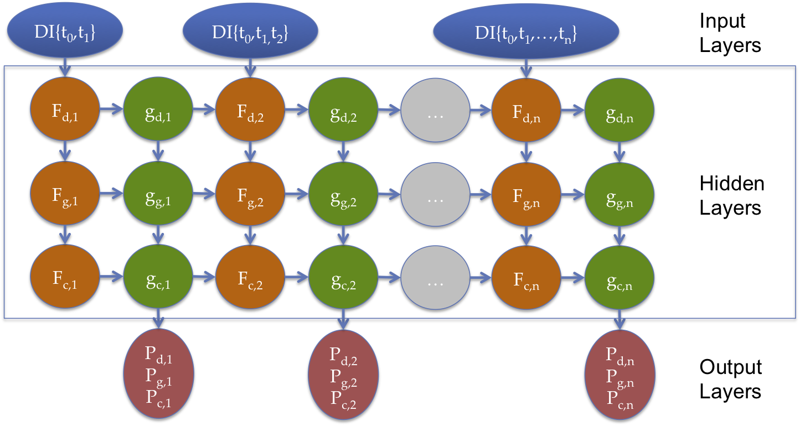

# Smelling Sepsis
=================
A cascading, series model to quickly and accurately predict the first three steps in sepsis diagnosis utilizing electronic nose sensor data from [Specific technologies](http://specifictechnologies.net/).

## i. Contents

+ [What is sepsis?](#sepsis)
+ [How do we smell sepsis?](#csa)
+ [Designing a Cascading, Series Model](#cascadeseries)
+ [Longitudinal Analysis](#features)
+ [Designing a Triggered, Series Model](#trigger)
+ [Results](#results)
+ [Installation and Dependencies](#install)
+ [Data format and data structures](#data)
+ [Code walkthrough and examples](#code)
+ [Contact](#contact)


## <a name="sepsis"></a> What is sepsis?

Sepsis is the bodies overwhelming immune response to infection and is often caused by a blood stream infection by fungi, or, most commonly, bacteria. Sepsis constitutes a serious medical emergency requiring immeadiate medical attention.  258,000 americans die from sepsis every year and it remains the leading cause of death of conditions contracted once in the hospital (e.g. an infection developed after surgery) and the third leading cause of death in the U.S.  Global statistics are harder to estimate; in the developing world it is estimated that 60-80% of deaths are from sepsis *(for more information on sepsis and treatment, read about it [here](http://www.sepsis.org/) or [here](http://www.world-sepsis-day.org/?MET=SHOWCONTAINER&vCONTAINERID=11).*

Treatment of sepsis is all about speed: fast action is the key to survival.  But current treatment requires a four-step diagnositc process that can take up to a week.  The longer treatment is delayed, the more bacteria proliferate, lowering the likelihood of survival.  Below, I outline the four steps.

*NOTE: I am not a microbiologist nor a physician, but I will do my best below to walk you through some of the medical and scientific jargon below.*
	
#### 1. Detection - Am I sick?

+ 8 hours to 4 days (to confirm negative)

First, a doctor needs to confirm that you have an infection.  They perform a **blood culture** by taking a small sample of your blood (typically 10 mL) and injecting it into a bottle  of growth media designed to provide the optimal environment for bacteria, if present, to flourish and grow (i.e they **innoculate** a *"blood culture"* or *"growth media"* bottle).  The innoculated blood culture bottles is then placed inside a **blood culture instrument** which tracks the presence of carbon dioxide expired by bacteria as they grow.  If bacteria are present, they will rapidly multiply, produce a large amount of carbon dioxide, and the blood culture instrument flags the sample as **postitive**.

With the results in hand, and note that a big time lag can occur waiting for the lab to re-open the next morning, e.g., your diagnosis continues with the proceeding steps.  At this stage a doctor may start you on a course of **broad-spectrum antibiotics**, drugs designed to combat many common types of bacteria (e.g. methicillin).  But this is performed with significant hesitation: broad spectrum antibiotics kill a large number of helpful bacteria that live in and on you, and *septic* patients (patients displaying the symptoms of a blood stream infection) already have weakened immune systems by fighting their infection.  Additionally, and with increasing importance, the spread of **antibiotic-resistant strains** of bacteria *(e.g. [Methicillin-resistant Staphylococcus aureus, or MRSA](http://www.cdc.gov/mrsa/))* have caused the medical community to carefully consider when to use certain drugs.  Your doctor would much prefer to know exactly what is causing your infection and precisely the best, most specific drug to treat it, but they need more information.

#### 2. Gram - What family of bacteria is making me sick?

+ <1 hour *(when lab technician is available)*

Second, a doctor wants to narrow down the cause of your infection.  A [gram stain](https://en.wikipedia.org/wiki/Gram_staining) will classify bacteria as either **gram positive** *(e.g. [Staphylococcus aureus](http://www.cdc.gov/HAI/organisms/staph.html), or "staph")* or **gram negative** *(e.g. [Escherichia coli](http://www.cdc.gov/ecoli/), or "E.coli")* depending on the characteristics of their cellular membranes. A technician takes a sample of the bacteria grown in the blood culture bottle during the detection step and performs a simple benchtop test.  This result informs which type of tests to run in the next two steps of diagnosis.

Gram stains are routine tests for a microbiology lab tech, but require a tech to do the work and to start the next steps.  Many hospitals are moving to centralized labs (i.e. a remote facility that runs all four of these diagnostic steps for many hopsitals in the region), which adds sample transport and results reporting delays.


#### 3. Identification -  What specific type of bacteria is making me sick?

+ Several hours to up to several days

Third, a doctor will want to know exactly what is causing your infection by determing the bacterial **species**.  The microbiology diagnostic community is a buzz with [emerging techniques](http://www.mayomedicallaboratories.com/articles/hottopics/2012/02-bact-id/index.html) to speed-up and automate this step *(at least for well-funded hospitals)*, but traditionally this is performed by, again, sampling from the bacteria grown in the blood culture bottle in step one and placing it on a petri dish (i.e. **plating** or **re-culturing** the bacteria).  The bacteria is re-grown and inspected under a microscope by a trained microbiologist who knows what they are looking at and can determine what it is with the help of other assays that vary depending on what they see.

With the **species ID** in hand, your doctor is ready to determine what **strain** of bacteria you have, where a strain is a variant of a given bacterial species characterized primarily by which drugs are effective or not effective in treating it, as discussed in the last step.  Despite the advances linked to above, this step is also subject to time lag by technician availability or a lab facility being open or closed.

#### Susceptibility - How do I treat what is making me sick?

+ Up to one day

Fourth, your doctor wants to know what drugs are effective and what **dosage** is appropriate.  Using samples of the bacteria grown in the third step, lab technicians will try combinations of drugs and doses of those drugs and observe if cell death occurs in the microliter sized wells of *micro-titer plates* (i.e. a miniturized testtube rack).  They are hoping to find a **narrow spectrum antibiotic**, a drug that primarily kills only the infectious bacteria and does minimal harm to the "good" bacteria in your body, and know the "goldilocks" amount of that drug to administer.

With the susceptibility test results in hand, your doctor prescribes the appropriate drug and, hopefully, it can be administered in time to fight of the infection invading your body.  But in many cases, this process simply takes too long.

## <a name="csa"></a> How do we smell sepsis?

[Specific technologies](specifictechnologies.net) is a Mountain View start-up applying electronic nose technology to medical diagnostics.  Their technology is cheap and appropriate for low-resource conditions (like developing countries).  It revolves around detecting the color changes of an array of colorimetric indicators (think many flavors of [litmus paper](https://en.wikipedia.org/wiki/PH_indicator), so tailored to change color to a wide variety of chemical compounds beyond just changes in pH).  These so called **[Colorimetric Sensor Arrays](http://www.scs.illinois.edu/suslick/smell_seeing.html)**, or **CSAs**, were invented by Prof. Ken Suslick at the University of Illinois.  An example colorimetric sensor array is presented in [Figure One, box A](fig01) *(reproduced from [Lim et. al., J. Clin. Microbiol., 2014, 52 vol 2](http://jcm.asm.org/content/52/2/592.short
))*.

#### <a name="fig01"></a> Figure One - Specific Technologies uses CSAs to diagnosis sepsis.
*A colorimetric sensor array, (a), is placed on-top of a blood culture bottle, (c), and "smells" the headspace volatile organic compounds of bacteria as they grow via an opening or semi-permeable membrane in the bottle cap, (b).  Tests were performed at Stanford University in standard lab incubators using a lab shaker and custom rack, (d), where the CSAs where image through the cap by a flatbed scanner.*


Each colored spot is a different color-changing **indicator** that responds to different sets of chemical compounds it interacts with, or "smells" (i.e. each spot is a chemical sensor).  Like mamalian-noses, each spot is not specifically responsive to one thing; the combination of their responses, rather, distinguishes the **volatile organic compounds**, or **VOCs**, the sensor array is "smelling".  Given the high dimensionality of these arrays, CSAs can distinguish thousands of different VOCs, and do so at low concentrations *(see, for example, [Feng et. al., Chem. Commun., 2010, 46, 2037-2039](http://www.scs.illinois.edu/suslick/documents/chemcomm.20102037.pdf).)* Furthermore, the high-dimensionality of these arrays allows for a "smell fingerprint" of cocktails of VOCs (i.e. complex mixtures of chemical compounds) which can be used to identify different things, including the different sets of respiration products of different species of bacteria (i.e. the different things different bacteria exhale as they grow).

Specific Technologies is using CSAs to combine the first three steps of sepsis diagnosis, (detection, gram and identification), into one automated step, and signficantly speeding up the diagnositic timeline in the process.  The CSA, shown in [Figure One a](fig01), is incorporated into a plastic cap that fits over a standard blood culture bottle, as shown in box c.  The caps are transparent so that they can be imaged, e.g. by a flatbed scanner, and the color of each spot can be tracked over time.  As bacteria grow, respiration VOCs accumulate in the headspace of the bottle (i.e. the gas above the liquid), and the CSA "smells" these volatiles by their passive diffusion through an opening in the lid or through a permeable membrane, as shown in b.  By imaging the CSAs at regular intervals and tracking the change of color of each spot (i.e. the red, green and blue components) over time, the response curves provide distinguishing signals for different species of bacteria.  Some example data for four classes of bacteria and individual color channels of 3 indicators are shown in [Figure Two](fig02) below (*(reproduced from [Lim et. al., J. Clin. Microbiol., 2014, 52 vol 2](http://jcm.asm.org/content/52/2/592.short
)).*

#### <a name="fig02"></a> Figure Two - Example Response Data
*Example color difference image, (a), and time series (b) for 4 bacterial species and three indicators. The difference maps are the average (after - before) for each class at the time of indentification mapped onto the same grid as the physical arrays (Figure One a).  The values are shown via the spots color. The time series represent how one color channel (red, green or blue) for one indicator (one of the colored spots) have changed color over time (in hours since inncoulation), grouped by class.  They are shows as percent change in spot color (I(t)-I(0))/I(0), where I(t) is the median pixel intensity for a color channel (R,G,B) at time t.  The grouped responses of all of the indicators allows for classification.*


In the experiments performed in [Lim et. al., J. Clin. Microbiol., 2014, 52 vol 2](http://jcm.asm.org/content/52/2/592.short), Specific Technologies and Dr. Niaz Banaei at Stanford University spiked blood culture bottles with known amounts of bacteria and pathogen free blood and tracked the response of CSAs as they sampled the bottles headspace.  For 1078 trials including 17 species of bacteria plus uninnoculated controls, they observed distinguishing resopnses such as those shown in [Figure Two](fig02).  In a), the color difference maps show the overall pattern of color change of bacteria at a given time.  The difference maps are the average (after - before) for each class at the time of indentification mapped onto the same grid as the physical arrays (Figure One a).  The values are shown via the spots color.

More interestingly, in b) time series responses of a few channels and bacteria are shown.  Each box in b) is a the percent change in color for one color channel (red, green or blue), where each line represents a single trial for a bacteria of that species.  Thus, one green line in row 1 column 1, one blue line in row 2, column 1 and one red line in row 3, column 1 would correspond to one "observation" *(see [data](#data) for more details)*.  The combination of the curve shapes for these different indicators provides the basis for: 

1. **Detection** 

	- Controls, although not pictured, do not have the dramatic up or down turn corresponding to the exponential growth phase of bacteria you see at, e.g., ~ 9 hours for E.coli in row 1, column 1.

2. **Gram**
	
	- Since you know the gram stain if you know the identification
	
3. **Identification**

	- Notice, e.g., that E.coli and K.pneumoniae both show changes in the bottom 2 rows, but K.pneumoniae does not shwo changes in row 1.  This means the K.pneumoniae does not produce volatiles that interact with Spot 1, although E.coli does.

Thus, the Specific Technologies paradigm can provide for the first 3 steps of sepsis diagnosis in a single step.  Since no intervention by a lab technician is required, and because the CSA is, itself, sensitive enough to probe the difference in bacteria, you can determine the species identification at the same time or 1-2 hours after you know that a patient is infected, saving hours to days in the diagnosis timeline.  This is enormously impactful, and the promising results Specific Technologies has already achieved as they continue to commercialize this product mean the potential to save millions of lives.

Graciously, Specific Technologies provided me the raw data from their publication which I used to try out new approaches to their multi-class classification problem.

### Project Definition

My capstone project was to use machine learning technique to see how quickly and how accurately I could diagnose sepsis.

## <a name="cascadeseries"></a> Designing a Cascading, Series Model

To build a model that will function appropriately on-board a piece of diagnostic equiment, it needs to provide the answers to all three of detection, gram, indentification questions as well as handle incoming data the same way it would be received in real time.  To do this, I built a custom a **cascading, series model**, which I explain below.

### Cascading

It's a cascading model because, at each timestep, it answers the three questions in series and feeds the results of each forward (down the psuedo decision tree).  At each timestep, the model predicts detection first, and feeds the probability of positive as a feature to the gram model.  The gram model, similarly, feeds the gram positive and gram negative probabilities forward to the classification model, and the classification model also accepts the detection positive probability.  This is shown diagramatically in [Figure Three](fig03).  

#### <a name="fig03"></a> Figure Three - Classification Cascade
*Cascading models for classification.  At each timestep, a detection model first predicts probabilities of each case.  The positive detection probability is fed forwad to the gram model, and the gram positive and gram negative probabilities (again, the control probability is omitted to maintain linear independence of the features) to the classification model.*


I had a couple of choices here and chose a cascading model due to not only its uniqueness, but also its flexibility.  You could build a flat classifier (predicts one of 17 bacterial species plus control), but it may not be as sensitive to control versus not control (i.e. detection negative or detection positive) than a model trained to do that exclusively.  Similarly, you could build a stacked model, where you don't attempt to answer the gram question until you are certain (i.e. crossed a certain threshold) on the detection question; then, you'd build a gram positive model to distinguish gram positive species if your gram model crossed a certain gram positive threshold, and a similar setup for the gram negative bacterial species.  

You might expect a stacked model to do the best job at distinguishing individual species of bacteria, since each of the sub-models has fewer classes to distinguish.  But I believe it will be slower (i.e. take more timesteps to predict accurately) because you are delaying any decisions about later questions until you are sure about the earlier questions.  You could correct that by model tuning to have, for example, a very low threshold for detection positive, but this could quickly lead to a lot of false positives.  It also leads to a less flexible structure for implementation with future models.

A cascading model, on the other hand, can update answers to all three questions simultaneously while using the probabilities from decisions higher-up the decision tree to pseudo-limit the number of classes each model subsequent model has to look at.  This is all handled via the SeriesModel class in seriesmodel.py

Although I haven't implemented these options yet (it's a relatively straightforward patch I look to add in a future release) to directly compare performance between the three model types, it would certainly be worth the future efforts to see if my intuition is correct.

### Series

It's a series of models because it needs to answer the question of how quicly can you diagnose my sepsis, not just how accutately.  Consider again [Figure Two](fig02), where the data extends to 18 hours.  Could you make the same predicitions about species if you only had, for example, half of the data (up to 9 hours)?  What about at 12 hours?  Since my objective is to not just accurately, but also quickly diagnose sepsis, early time model performance is extremely important.  Class difference at early times are much more subtle than at later times, so you would expect a model trained with 18 hours of data to perform poorly on only 6 hours of data, and vice versa (not to mention that, unless you are smart in your feature extraction, they are likely to require different numbers of features).

To allow for course correction or increasing confidence of one diagnosis or the next, the models should inform each other.  I like to think of the "did I miss my turn" example when you're trying to get some place you haven't been to before.  Shortly after missing your turn, you might not be particularly confident one way or the other.  But as time continues and you continue to see unexpected landmarks, you would become more concerned.  It's not a memory-less process: each individual unexpected steet sign might not, on its own, convince you that your lost,  but their repeated observation is what makes you turn around.

To accomplish this, I built a series of cascading models where the probabilities at the previous timestep are fed as additional features to the current timestep, shown diagrammatically in [Figure Four](fig04).


#### <a name="fig04"></a> Figure Four - Series of Models

*A series of cascading models is constructed, where the set of probabilities from model built with i-1 timesteps, {p<sub>i-1</sub>}, is fed to the model cascade at time t<sub>i</sub>.*


## <a name="features"></a> Longitudinal Analysis

The analysis of repeated measures of the same subjects is known as longitudinal analysis.  It's generally used in, for example, clinical trials where it's more cost effective to sign-up 100 people and track their health multiple times over the course of a few years than it is to sign up a 1,000 or 10,000 people and check their heath once. Then you answer questions like: do the participants receiving the cholesterol drug have different changes in LDL and HDL overtime versus the placebo group?  Can I predict which drug will be most effective for this patient given their health history and what I know about the efficacy of different drugs on similar patients?

If you were to describe my problem in one sentence, it would be a multinomial logistitic regression problem with longitudinal effects.  So my first approach was to try and use these types of models.

The big difference between linear or logistic regression in longitudinal analysis and standard regression is the structure of the covariance matrix.  When you regress, for example, engine size versus mpg, each data point is an individual car, so each observation is assumed independent.  Furthermore, it is assumed that a single variance, s<sup>2</sup>, describes the variance of each of the data points and is the diagonal of the covariance matrix.  The observations X<sub>i</sub> and X<sub>i+1</sub> are assumed to be not correlated (the off-diagonal terms in the covariance matrix are 0).  Regression is the fitting of a univariate normal distribution.

In longitudinal analysis, the individual data points are necessarily not independent.  In our cholesterol drug, LDL/HDL example, if someone started with higher baseline cholesterol levels, you expect the next measure of their cholesterol to be somewhat close to the first measure.  This, effectively, means your data's distribution around any best fit line should be "tighter" than in the usual regression case.  Depending upon the level of correlation between repeated measures, the covariance can have many non-zero terms.  Regression is the fitting of a multivariate normal distribution where all the terms in the covariance matrix must be computed.

I'm not aware of any python packages for generalized linear mixed effects *("generalized linear" since its logistic regression, "mixed effects" because of the mixed effects of repeated obervations from a single trial)*.  R has at least a couple of implementations: lme4 with glmr and mcmcglm.  I tried to use both of these with this project (and experimented with the rpy2 wrapper to access them through python), but unforunately they can't handle data of my type.  

In mcmcglm, the structure of the covariance matrix can't be specified.  This matters because our 219 features (each of which is repeatedly observed 60-145 times), are necessarily correlated beyond just the each feature is correlated with itself in time.  Recall that the 219 features came from 73 spots broken into 3 color channels each.  Thus the color channels from a given spot are correlated *(another idea for future work is experimenting with different color scale transformations to more appropriately incorporate this into my models)*.  Additionally, many of the spots respond to the same chemical compounds.  As a toy example, presume both spot 5 and spot 6 respond to carbon dioxide.  Although they won't respond identically, once bacteria start to produce carbon dioxide in significant amounts, there responses will be correlated.

lme4 allows for specifying the structure of the covariance matrix.  But I could not get it to converge for data of this size (see [data](#data) for more details).  In fact, even with very small subsets of the data, resulting in only 10,000 or so terms to estimate in the covariance matrix, I could not get this solution to converge.

Fitzmaurice, Laird and Ware in their excellent [Applied Longitudinal Analysis, 2nd edition](http://www.hsph.harvard.edu/fitzmaur/ala2e/), provide sample datasets and sample R code for the use of lme4 and glmer to solve generalized linear mixed effects models.  You can view the sample code [here](http://www.hsph.harvard.edu/fitzmaur/ala2e/R_sect_16_5.html) (look at the second example), and download the data in text format [here](http://www.hsph.harvard.edu/fitzmaur/ala2e/ecg-data.txt) (and read about the source of the data [here](http://www.hsph.harvard.edu/fitzmaur/ala2e/ecg.txt)).  The solvers happily converge for data of this size (about 100 rows).

### Feature Extraction via Curve Shape Parameters

Since traditional longitudinal analysis would not work for my dataset, I needed to develop other feature extraction techniques that in some way incoporated the time-correlation of the repeated measures of each spot for a given trial.  I also wanted to limit my feature space to a sizeable amount since, at timestep 60, I could have 219 features X 60 times = 13,140 features for 1,078 trials.

Recall from our inspection of the raw data in [Figure Two](#fig02) that the shape of the curves more than the value at any given timestep are what makes different bacterial species distinguishable.  Thus, I suspected that extracting features to describe the shapes of the curves would be the best features for any model.

To incorporate time-correlation and extract a response curves shape, I curve fit the trace of each spot and each color (at each timestep) to two forms: n<sup>th</sup> order polynomials in time and sigmoidal in time.  That is, where DI<sub>i,j</sub> is the change in color of spot i over the set of timesteps {t<sub>0</sub>, t<sub>1</sub>,...,t<sub>}</sub>}, I fit the following two equations:

##### <a name="e01"></a>Equation 1:
+ DI<sub>i,j</sub>(t) = b<sub>0</sub> + b<sub>1</sub>t + b<sub>2</sub>t<sup>2</sup> + ... + b<sub>p</sub>t<sup>p</sup>
	+ polynomial.  p = 4 (in best performing models)

##### <a name="e02"></a>Equation 2:
+ DI<sub>i,j</sub>(t) = 1/(A + exp(-kt + B))
	+ sigmoidal

Polynomial fitting *([eqn 1](#e01))* was easily accompolished using sklearn PolynomialFeatures to generate t, t<sup>2</sup>, ... , t<sup>p</sup> and regressing with either OLS, LassoCV or RidgeCV.  OLS did a fine job of keeping consistent shape parameters at late t and was computationally much faster than the grid-searching, regularization methods, for which I didn't notice significant model performance.  I demonstrate some example curves below with raw data and their fourth order fits in [Figure Five](#fig05).

#### <a name="fig05"></a> Figure Five
*Examples of fourth order polynomimal fits for the change in color of a given spot in time, DI<sub>i,j</sub>(t).  The colored circles represent the raw data and the similarly colored line the fit.*


Considering the mechanism with which we observe color change from a gien spot, we might expect sigmoidal features *([eqn 2](#e02))* to end up the strongest in a predictive model.  Chemical reaction kinetics as well as bacterial growth are known to show sigmoidal shapes, where the parameters in *([eqn 2](#e02))* could represent: 

+ B: 
	- bacterial growth kinetics: growth lag period
	- reaction kinetics: concentration threshold for reaction of a given indicator or adsorption of given molecule onto the surface of the chemical sensor
+ A:
	- bacterial growth kinetics: stationary phase maximum concentration
	- reaction kinetics: saturation concentration for the indicator (reversible) or consumption of indicator (irreversible reactions)
+ k:
	- bacterial growth kinetics: exponential phase rate of growth
	- reaction kinetics: reaction rate constant and/or rate of reaction when the reactant is present in excess

This connection to chemical and biological processes made me strongly believe coming into the projects that sigmoidal curve shape features would be, by far, the best features for improving model performance.  For a small number of timesteps, however, it is very challenging to approximate these parameters.  Consider, for example, a toy case in [Figure Six](#fig06) below.


#### <a name="fig06"></a> Figure Six
*Examples of sigomidal curve fits ([eqn 2](#e02)) for the change in color of a given spot in time, DI<sub>i,j</sub>(t).  The grey circles represent toy data generated by adding noise to the sigmoid with parameters A=0.25, C=-3, k=1.25.  The green, blue, red, light blue, and purple lines represent best fit curves with 10, 12, 20, 30 and 40 timesteps fed in of 40 total timesteps.  The vertical dashed lines represent these time cut-offs*


With a small number of timesteps fed in, using scipy's curve_fit function, a broad family of parameters will fit the data.  And since the cost function is not globally convex, the paramters chosen pick a sigmoid that plateaus at the maximum value yet perceived.  You can see in the legend that A, k and C are all poorly approximated for a small number of timesteps fed in.  Thus, despite its chemial and biological relevancy, sigmoidal curve shape parameters did not perform well when model tuning.

### Scaling and Dimensionality Reduction

With the features extracted, I then used sklearn's standard scaler for each feature (at each timestep) since many classification models are sensitive to features on very different numeric scales.  I also reduced the dimensions with PCA to go from 73 spots X 3 colors X 3-4 curve shape parameters = 657-876 features per timestep to a smaller number (say 30-40).  Here again I used sklearn's PCA, specifying the number of components in the output.

NOTE: the probabilities reported from each model were never scaled since they already exist on a 0-1 scale.  Additionally, only the curve shape parameters were reduced by PCA, with the probabilities from a previous timestep or higher up the decision cascade being appended after dimensionality reduction.

### Model tuning

Model tuning was particularly challenging for this product and remains an area where improvement can likely still be made.  Considering the desing of the cascading series model, I effectively created a neural network with inner layers reporting their probability.  I show this diagrammatically in [Figure Seven](#fig07).

#### <a name="fig07"></a> Figure Seven - pseudo Neural Net architecture
*The architecture of the cascading series model.  Input layers: At each timestep, the color changes for all of the spots up to that timestep (DI{t<sub>0</sub>, t<sub>1</sub>,...,t<sub>j</sub>) are fed in to the model.  Hidden layers: A featurizer (F<sub>d,j</sub> for detection, F<sub>g,j</sub> for gram, F<sub>c,j</sub> for classification) extracts, scales and does dimensionality reduction on the relevant features and passes them to the models (g<sub>d,j</sub>, g<sub>g,j</sub>, g<sub>c,j</sub>.  The models pass the probabilities of detection, gram and classification to the output layers as well as to the next timestep's hidden layers.*



Here the blue circles represent the data being passed in at each timestep.  The orange circles are the featurizer, scaler and dimensionality reducer for detection, gram and classification at that timestep.  The green circles are the model for detection, gram and classification.  A zoom-in for a singletimestep is shown in [Figure Eight](#fig08).

#### <a name="fig08"></a> Figure Eight - pseudo Neural Net architecture at timestep j

*The architecture of the cascading series model zoomed in to timestep j.  The color changes for all of the spots is fed in from the j<sup>th</sup> input layer as (DI{t<sub>0</sub>, t<sub>1</sub>,...,t<sub>j</sub>) to the featurizers (f<sub>d,j</sub>, f<sub>g,j</sub>, f<sub>c,j</sub>).  Here, f<sub>d,j</sub> is the featurizer (e.g. polynomial curve fit, sigmoidal curve fit, etc) for detection at the j<sup>th</sup> timestep.  Additionally, the probabilities calculated in the hidden layer of the j-1<sup>th</sup> timestep are fed in to their respective featurizers.  The extracted features are then scaled by the scalers (s<sub>d,j</sub>, s<sub>g,j</sub>, s<sub>c,j</sub>), and the number of features reduced by the dimensionality reducers (r<sub>d,j</sub>, r<sub>g,j</sub>, r<sub>c,j</sub>), with each featurizer feeding its respective scaler, each scaler feeding its respective reducer.  These final features are then passed to the respective classifier/model, where the detection model, g<sub>d,j</sub>, passes the detection probabilites, P<sub>d,j</sub>, to the gram model, g<sub>g,j</sub>, which passes the gram probabilities, P<sub>g,j</sub>, to the classification model, g<sub>c,j</sub>.  All of the probabilities are reported to the output layer, as well as passed along to the respective featurizer at the j+1<sup>th</sup> timestep.*


As described in [Figure Three](#fig03), the model is cascading: at each timestep, the detection classifier, g<sub>d,j</sub>, feeds the gram classifier, g<sub>g,j</sub>, which feed the classification classifier, g<sub>c,1</sub>.  The model is series as in [Figure Four](#fig04) since the classifiers at timestep j pass their results along to timestep j+1 (g<sub>d,j</sub> connects to F<sub>d,j+1</sub>).  This could be described as the hidden layers of a neural net.  The input layers are the passing in of data up to that timestep, and the output layers are the reported probabilities at each timestep.

Put all together, for the ~ 50 timesteps I considered, I created 3 featurizers, 3 scalers, 3 dimensionality reducers and 3 models.  These all interact with each other, as shown in the interactions at a given timestep in [Figure Eight](#fig08).  This means I have 150 interdependent models, featurizers, scalers and reducers all of which have tuning hyperparameters.  This is an enormous model space to explore and one I continue to explore now to find better performance.

To handle searching this model space I made a few simplifications.  I created a job-runner file, capstone.py, that accepts a runid on the command line that corresponds to where the output results should be written and from what json the run parameters should be picked.  I placed a sample json in the data folder.  The json describes how the SeriesModel object (my class for handling the models illustrated in [Figure Seven](#fig07) and [Figure Eight](#fig08)) is constructed.

Furthermore, I required the type of featurizer, scaler, reducer and classifier/model for each timestemp to be consistent (and stated in the run parameters json).  These are, e.g., the detection-base-model and detection-base-model-arguments, detection-base-featurizer, detection-base-featurizer-arguments, etc. of the SeriesModel class.  A summary of the types of models, featurizers, scalers and reducers I experimented with is listed below:

+ Featurizer
	+ polynomial: 3rd or 4th order
	+ sigmoidal
	+ NoneType *(i.e. pass in all of the features as is)*
+ Scaler
	+ Standard
	+ NoneType *(i.e. does no scaling)*
+ Dimensionality Reducers
	+ PCA: 10, 30, 40 or p components, where p is the number of features extracted by the Featurizer
	+ NoneType *(i.e. does no dimensionality reduction)*
+ Models
	+ Logistic Regression: regularization of 0.1, 1 and 10
	+ Logistic Regression CV: auto-optimizes the regularization parameter via gridsearching
	+ Stochastic Gradient Descent Boosting Classifier
	+ SVM Classifier: 0.1, 1, 10 penalty parameter
	+ Random Forest Classifier: 10, 50, 100 trees

I ran these jobs by spinning up EC2 instances.  The "slow" step is the featurization, so I typically did this up front and pickled the results to pass along to other models using the same detection, gram and classifier featurization methods.  Thus, the SeriesModel class contains a load_state parameter to describe where to "start" the model from.

Featurization is a place where parralellization could help improve speed, but I didn't have time to translate it to pyspark.  This is another area of work in progress.

### Crossvalidation

I used sklearn's StratifiedShuffleSplit to generate 10 folds of 90% train, 10% test data where each classification label (17 bacterial species plus control) was evenly split over each of the folds.  All featuriers, scalers, reducers and models were trained on the training folds, and evaluated best on their predictions for the corresponding testing folds.  This generated a set of ~110*10 = 1,100 detection, ~1,110 gram and ~1,100 classification predictions for each timestep.

### Model Evaluation

I built up a suite of multiclass metrics and reporting in mutliclassmetrics.py.  This began with construction detection, gram and classification confusion matrices *(at each timestep)*, and then computing the various performance metrics on a one-versus-all and micro and macro averaged premise: accuracy, recall, precision, f1.  To pick the best model, I observed how all of these metrics evolved as more timesteps were included.  Recall that a perfect model has excellent metrics at a very early time. 


## <a name="trigger"></a> Designing a Triggered, Series Model

My initial results from the cascading series models were promising, but I felt there was still room for improvement.  Specifically, I was still subject to some overfitting.  My hypothesis for why came from revisiting the color change responses for characteristic, early responding spots of a particular bacteria, as shown in [Figure Nine](#fig09) below.

#### <a name="fig09"></a> Figure Nine - Varying "Trigger" Times
*The color change versus time for one type of bacteria at one characteristic spot.  The curves all have very similar shapes, but at any given time, there exists a large variance in the curves' shape and values.  A reference time of t=4 hours was used for calculating the color change.*


As you can see in [Figure Nine](#fig09), the curve shapes are all similar.  At any given time, however, there exists a large variance in the curves' shape and values.  Assuming the time at which the curves drastically change represents the time at which the bacteria in that particular observation entered their exponential growth phase, this time-shift in the curves represents the biological variability in the trials as well as the sampling variability in the precise amount of bacteria a given trial was innoculated with.  I wondered if I could collapse these curves on to some new time scale, t* = t - tau, where tau was the "growth" time, or time at which the big changes in these curves appeared.

Looking at the full 20 hours of the curve, it is clear that the time at which the absolute maximum first or absolute maxium second derivaties occur whould be a good estimate of the taus, the "trigger" times, for each of these samples.  I show a couple examples of this in [Figure Ten](#fig10).

#### <a name="fig10"></a> Figure Time - Finding the "Trigger Times"

*Two examples of finding the "trigger" times for characteristic spots.  The blue circles represent the raw data.  The red, vertical lines show the time at which the absolute maximum first derivative occurred.  The green, vertical lines show the time at which the absoluted maximum second derivative occurred.  Numerical derivatives were calculated using a fourth order centralized pade scheme with third order boundaries.  These were then smoothed with a gaussian kernel with sigma=2.*


Looking at the full time curve as shown in [Figure Ten](#fig10), simple backward differencing can correctly find the absolute maxium derivatives.  But, thinking forward to how you could detect if a trial had "triggered" in real time, I needed a differentiation scheme that would have low errors at the boundaries.  I imagined building a "trigger" model that, once a trial was confidently predicted to have entered this exponential groth phase, would send the data to the t* = 0 gram and classification models.  I needed to be able to collapse the curves by time-shifting and I needed to know how to do that time-shifting as each individual timestep was fed in.

Simple forwards or backwards differencing is subject to large numerical errors at the boundaries, so I constructed a centralized, fourth-order pade differentiation scheme with third order boundaries.  This provides a highly accurate estimate of the derivative of a curve by the solution of a matrix algebra problem.  You have to solve a tridiagonal jxj matrix multiplication problem, where j is the number of timesteps, but numpy's linalg.lstsq can do so quickly.  To add in an extra layer of numerical robustness, I further smoothed this results with a gaussian kernel *(sigma=2 worked the best)* to accurately predict this time of max change.

To determine if this trigger time had been reached, I trained a new set of models using the features of absolute max first and second derivatives from a handful of spots that consistently respond quickly for all types of bacteria.  This "Triggered, Series" model was asked to predict if a sample was innoculated, deteciton = 0 or 1, based ont the features calculated for the the timesteps up to that point.  Because the controls representeted ~ 10% of all samples in the available dataset, I used SMOTE oversampling on the training set when training the models to assure always predicitng detection=1 was not a viable model.  The ROC curves and other metrics showed significantly improved performance over the unshifted cascading, series model for detection.  They improved over time up to a high plateau at around 12 hours fed in.  Thus, I had found a time invariant feature that my models could use to predict when growth had occurred and, thus, the trigger time neccessary to shift the timescale before feeding in the data to the cascading series model.

The best way to see this is from kernel density estimates of the observed number of timesteps versus the estimated time of absolute maximum derivative, shown in [Figure Eleven](#fig11) below.

#### <a name="fig11"></a> Figure Eleven - KDE of Observed Time vs. Time of Absolute Max Derivative

*Kernel density estimates of the observed time vs. time of absolute maximum derivative for a characteristic spot for two different species of bacteria.  The x-axis represents the number of timesteps observed while the y-axis represents the time at which the maximum absolute first derivative was observed for the timesteps up to that point.  The shading represents the frequency of observations.  The horizontal band of dark shading at later times shows that the trigger time remains constant after it has been passed.*


[Figure Eleven](#fig11) represents the pair-wise density of (number of timesteps observed, time at which absolute maximum first derivative occurred) for two species of bacteria.  You can see that the majority of observations, indicated by the moderate shading, at early times are dispersely spread under the line y = x.  This means that until the "trigger" time is reached, the maximum derivative may have occurred at any time.  Since the curves are relatively flat before the trigger time, this makes sense - random fluctuations could make any change the "max" change before the "trigger" time.  But, since this corresponds to small values of the max change since these fluctuations are small compared to large change that occurs at the trigger time, our model shouldn't predict detection at these early times.

At later times, starting at around 14 hours for the curve on the left, 10 hours for the curve on the right, a dark horizontal band occurs at y=14 and y=10, respectively.  This means that once the "trigger" time has been reached, it is always returned as the time of absolute maximum first derivative.  Furthermore, if our model is tuned to predict detection = 1 based on the value of that absolute maximum derivative, we can sucessfully predict that a particular trial has "triggered" in real time, i.e. one timestep at a time.

To pick such a model from my set of models generated at each timestep, I considered the kernel density estimates of detection = 0  (controls), vs. detection = 1 (innoculated samples), shown in [Figure Twelve](#fig12) below.

#### <a name="fig12"></a> Figure Twelve - KDE of Observed Time vs. Time of Absolute Max Derivative for controls and innoculated samples

*Kernel density estimates of the observed time vs. time of absolute maximum derivative for a characteristic spot for controls (right in blue) and all species of bacteria (left in red).  The x-axis represents the number of timesteps observed while the y-axis represents the time at which the maximum absolute first derivative was observed for the timesteps up to that point.  The shading represents the frequency of observations.*


As was seen when comparing classification metrics versus time (e.g. recall), at around 12 hours observed, we have a high density of observation of maximum derivative also at 12 hours for the innoculated case (left in red).  For the control (right in blue), shading remains relatively diffuse over the full timescale and certainly no more dense at 12 hours observed.  This suggests that the 12 hours observed model can effectively find the "trigger" time for all samples.  I am currently in the process of retraining my cascading series model based on my best performing "trigger" model at 12 hours:

+ Model: Random forest with 100 trees
+ Features: Absolute maximum first and second derivatives from 5 spots showing early growth (10 total features)
+ Scaling: Standard Scaling
+ Dimensionality Reduction: PCA with 10 components

The "trigger" model determines the time-scale shift and gram and classification models are built at the tau = 0, tau = 20 minutes, ..., etc. timesteps.

## <a name="results"></a> Results

Due to the sensitive nature of the data used, detailed results beyond what has been presented thus far must be restricted.  Please see [contact](#contact) and get in touch with me if you are interested.

## <a name="install"></a> Installation and Dependencies

The best way to try-out the code yourself is to clone this repo:
```
git clone https://github.com/andersberliner/smelling_sepsis.git
```

Most of the packages I used are familiar and available in standard conda installations (numpy, scipy, pandas).  When working with Amazon EC2, however, I found that to utilize the multiprocessing capabilities of sklearns models, an upgrade is often required.  I recommend updating scikit-learn before trying to use the code for your use case.

```bash
pip install -U scikit-learn
```

Most other modules also available via pip, like seaborn for plotting extensions and pympler for memory diagnostics, should be easy to get.  For unbalanced datasets, I used the work of [F. Nogueira and G. Lemaitre](https://github.com/glemaitre/UnbalancedDataset).  You will need to clone the code from the repo and install.

```bash
git clone https://github.com/fmfn/UnbalancedDataset.git
cd UnbalancedDataset
python setup.py install
```

Use cases are shown [here](https://github.com/fmfn/UnbalancedDataset/blob/master/notebook/Notebook_UnbalancedDataset.ipynb), or see how I use it for oversampling in my code in triggeredseriesmodel.py.

If you want to try and use R functionalities in your python programs, know that rpy2 can be particularly challenging to get onto Amazon EC2 instances.  See their documentation for more help.

The code was designed to work with the Specific Technologies data pipline *(see [data structures](#data) to learn how to use it "out-of-the-box")*, and has some pieces built specifically around their use-case *([seriesmodel.py](/seriesmodel.py) currently only supports three-class label cascades)*.  That aside, I do believe there are a variety of other use cases where you could use this algorithm effectively with little effort.  See the [code walkthrough](#code) and please [contact me](#contact) for more help.

## <a name="data"></a> Data format and data structures


## <a name="code"></a>Code walkthrough and examples


## <a name="contact"></a> Contact
Like all of you out there developing your own models, it is my hope	